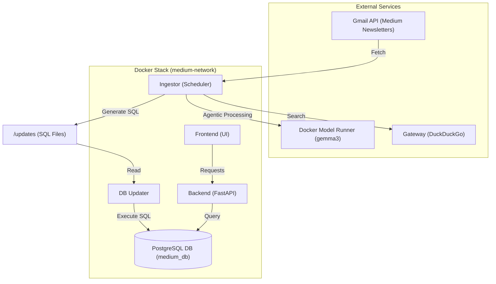
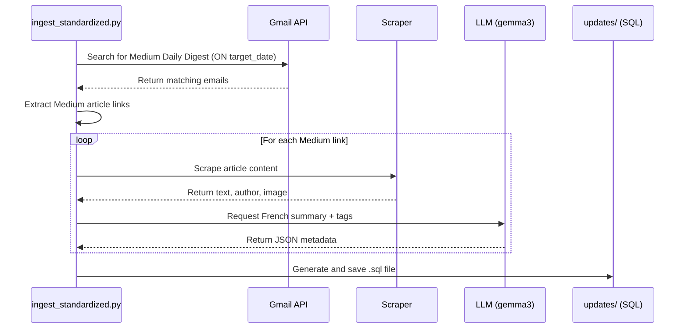

# Architecture - Medium Datligent

This document describes the architecture of the **Medium Datligent** project using a Mermaid diagram.

## Architecture Diagram

## Application Logic Flow (Ingestion)

*Voir aussi : [ingest_standardized.mermaid](file:///Users/adminmac/medium-datligent/ingestion/ingest_standardized.mermaid)*

The following diagram illustrates the internal logic of the `ingestor` service for Medium newsletters.

## Component Roles

- **Frontend**: User interface for exploring Medium articles.
- **Backend**: API serving article content and metadata.
- **DB (PostgreSQL)**: Stores Medium articles, summaries, and tags.
- **Ingestor**: Scheduled task that fetches Medium newsletters, uses gemma3 for French summaries, and outputs SQL.
- **DB Updater**: Watches for new SQL updates and applies them to the database.
- **LLM**: Local instance of gemma3 powering the metadata extraction.
